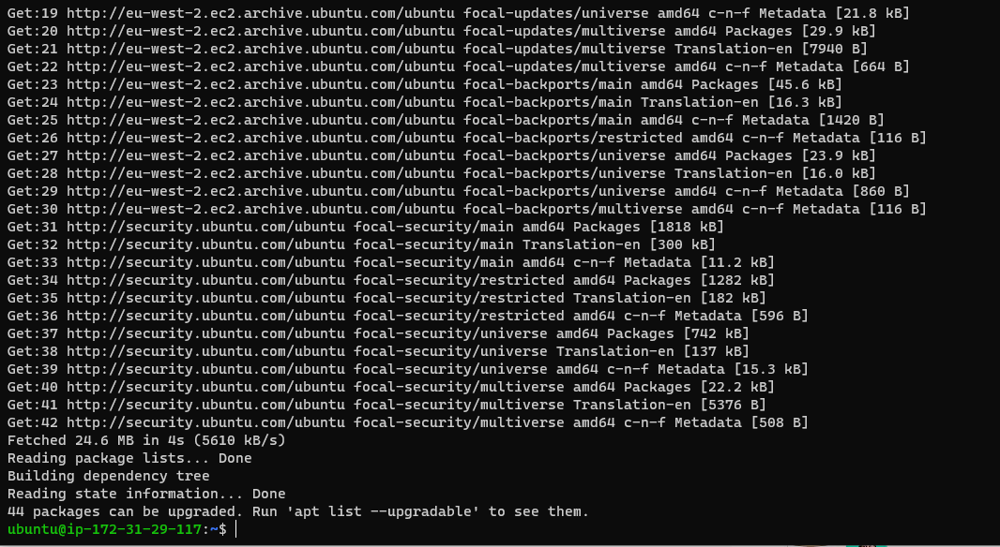

## CLIENT-SERVER ARCHITECTURE WITH MYSQL

`curl-iv`

`sudo-apt-update-y`

`sudo-apt-install-mysql-client-y`

`sudo-mysql-secure-installation`

`sudo-mysql`

`sudo-systemctl-enable-mysql`

`ip-addr-show`

